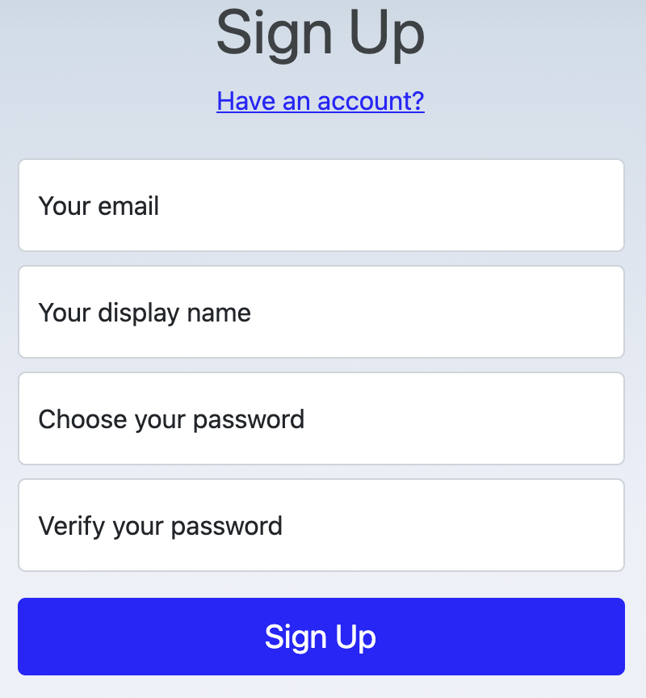

# Register an account

MetatoCome use email as user id, you may register with any email you use with it, however, if you are going to use MetatoCome as a company, you may consider register with your company email, especially when you are going to take the role of MetatoCome Administrator of your organization.

## Normal

Display name should be at least 3 characters, at most 12 characters, English or Chinese.

Password length should be between 6 to 12, beginning with a alphabetic, must contain at least one number and special characters like !@#$%&\* etc.

## Organizaton Staff

Organization staffs' accounts may be imported by administrators instead of being registered by staffs themselves.

If an to-be-imported account already exists, the owner will receive an email to join your organization.
