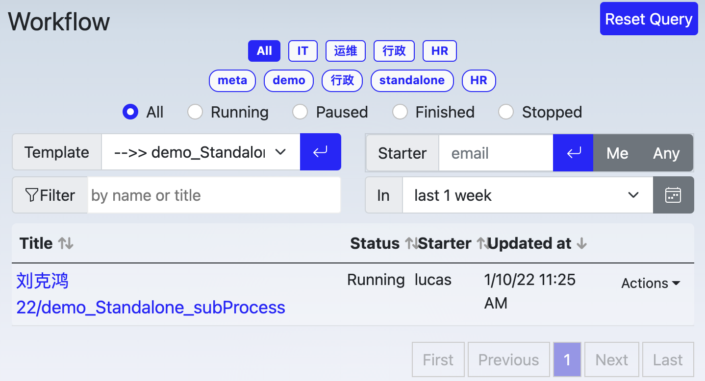
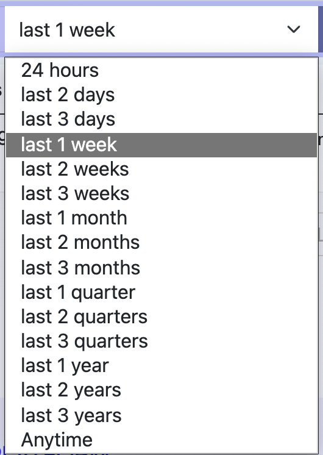
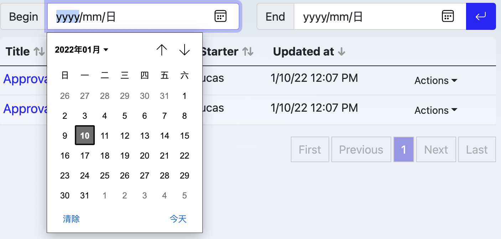
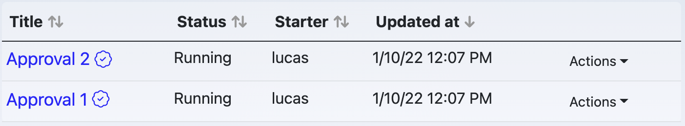
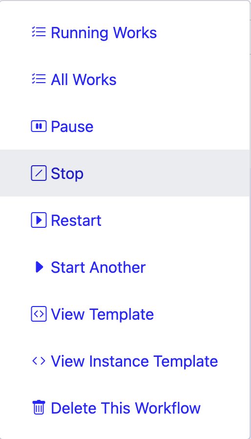

# Process Explorer

Process Explorer shows all processes, allowing management of these processes.

## User Interface

### Top buttons

- Reset Query: clear out any specified query criteria

Template explorer provides detailed criteria for searching, Reset Query is used to reset query critera by one-click

### Tags Area

Tags are used to categorize prococesses, organizaiton level tags are defined by administrators and available for everyone in your organizaiton, while personal tags are available individually.

- organizaitonal tags are displayed in a round corner rectangle, like 
- personal tags are displayed in a pill, like 

Click a tag, explorer will search those processes which template has with the tag and display them in the result table at the lower part of explorer.

### Extra Filter Area

#### Template

Filter processes with template id, only selected template's processes will be displayed.

#### Starter

Filter processes with starter email. "Me" sorts out processes start by you.

### Title filter

Filter processes by process title

### Time

Filter processes by starting time.

Within some time:

Between two dates:

### Result Table

List out any processes meet above requirements: tag, name filter, author， time span etc.

The first column is Process Title, clicking it will lead to [process overview page](/process/overview.md).

The fourth column is Action menu:

{width="200" align=left}

Those actions are:

`Running Works`

: See running work items belong to this process

`All Works`

: See all work items belong to this process

`Pause/Resume`

: Pause this process if it's running. running tasks are also paused (not be seen in work list). Resume this process if it is paused.

`Stop`

: Stop (or cancel) of this process

`Restart`

: Dismiss it's running and restart from the beginning

`Start Another`

: Start another process

`View Template`

: View the template of this process

`View Instance Template`

: View the instance template of this process. Once user start a process with a template, an instance template will be bundled to the process, after that, user might make some changes to the original template, while the instance template keep untouched.

`Delete This Workflow`

: Delete this workflow process

### Pagination

Use pagination to browser more results
