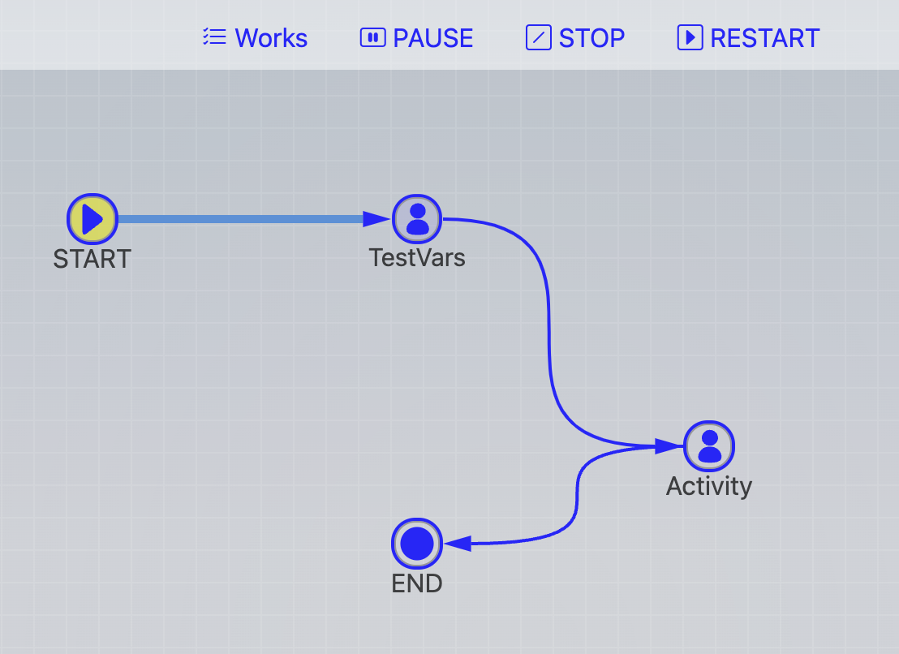

# Process Monitor

The display styles are:

## Nodes Status

For Nodes with different status:

- Completed: light green
- Running: flickering blue
- Hovering: yellow
- Not routed: blue

## Connection Status

For Connection with different status:

- Not routed: blue
- Passed: cyan
- Hovering: green

Shift-click on nodes or connections will bring up its property window

## Operations

- Works: Goto worklist, show work items of this process
- Pause/Resume: Pause/Resume the current process
- Stop: Stop (cancel) the current process
- Restart: cancel then restart

## Change user

If you are a member of "Admin" group, and current task is still running, you have a chance to change the participant to other people:

"For this": change user only for this task
"For all": change all occurance of exiting participants to new one
