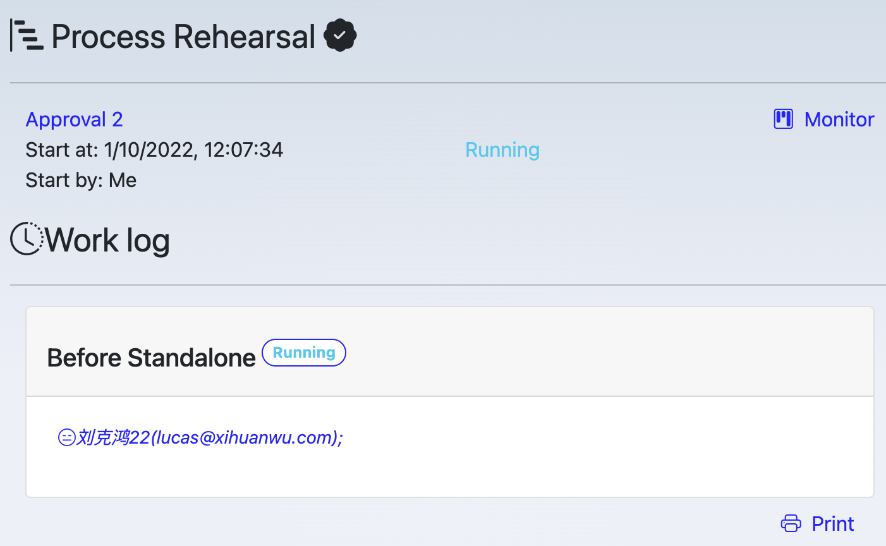

# Process overview

Show the overview of a process, it's title, start time, start by whom, current status, [work logs](/process/worklog).

Click on {width="80"} to go to the [process monitor](/process/monitor.md)

Click on {width="80"} to print the current page.

MetatoCome also keep engine level running log, to view it, click "Show log".

Engine level log is very helpful for Script, you may have "console.log" in your script log, then you could see their output in "Show log"

