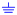

# Workflow Designer

Workflow Designer provides graphical user interface to design a workflow by dragging and dropping.


On the left is the toolbox, click each tool to use it.

## Pointer 

_Press ESC anytime to select Pointer._

Under Pointer mode, you are able to:

1. select a node or connect by clicking it.
2. open property window of node or connect by shift-clicking it
3. move a node by dragging it.
4. move a connection by clicking it while holding ALT key (Opt key on Mac OsX), release ALT key, then click on another node should be connected.
5. pan canvas by clicking on blank area of canvas then dragging it.

## Activity 

_Press 1 anytime to select Activity_

An activity is a task need to be done by human.

### Operations

- Click on canvas to place an Activity node
- Shift-Click on an Activity to open it's properties
- Drag it to move to another location

### Title

Activity (Task) title can include process level variables value by placing variable name in square brackets, like [var_name], [var_name] will be replace with the value of var_name.

For example: If you have a variable name 'Interviewee_name", and the interviewee is "John", then the work title with a name of "Please approve offer letter of [Interviewee_name]" will be "Please approve offer letter of John", Simple.

### Participant

Define task participants with Role Definition String,

See [PDS page](/designer/pds) for details

### Instruction

Give some instructions to people who take part in this task

You may include HTML tags/Handlebars tempalate or varName in brackets in instruction test.

####Supported HTML Tags

Only following HTML tags are supported:

"b", "i", "em", "strong", "a", "blockquote", "li", "ol", "ul", "br", "code", "span", "sub", "sup", "table", "thead", "th", "tbody", "tr", "td", "div", "p", "h1", "h2", "h3", "h4"

#### Handlebars

Handlebars format is used to include process variables. If a previous node has a variable named "days", then, {{days.value}} can be included in instruction to embed it's value in instruction.

#### Var in square brackets

[var_name] will be replaced with var value.

You may also have {{days.title}} {{days.type}} etc. included if required.

## Variables

define variable name, type etc.

### **Name**:

Variable name should be a valid javascript varialbe name,
that means, a variable name should start with an alphabetic, or underscore, followed by one to many alphabetic or underscore or numbers.
invalid name will make your workflow fails to run.

### **Variable Type**:

Variable name with specific prefix also indicates variable types, determing how Metatocome SaaS show it to end-users.

- "email\_" : an email type input.
- "password\_" : an password type input.
- "url\_" : an url type input.
- "range\_" : an range type input.
- "number\_" : an number type input.
- "dt\_" : an datetime type input.
- "datetime\_" : an datetime type input.
- "date\_" : an date type input.
- "time\_" : an time type input.
- "color\_" : an color type input.
- "search\_" : an search type input.
- "select\_" : a select type input.
- "sl\_" : a select type input.
- "sel\_" : a select type input.
- "file\_" : an file type input.
- "radio\_" : a radio type input.
- "textarea\_" : a textarea type input.
- "ta\_" : a textarea type input.
- "checkbox\_": a checkbox type input.
- "cb\_": a checkbox type input.
- "ou\_": an Organization Unit Selector
- "usr\_": an user ID type input
- "user\_": an user ID type input
- "tbl\_": an table type input.
- any other name : a normal input.

#### OU selector

A variable starts with "ou\_" will provide user a selection box of the current orgchart. The orgchart is configurable by people who have the correspoinding access right, normally, the MTC admin of your organizaiton.

An OU selector variable named as "ou_varname", it can have opitons like "top_ou_id;[yes|no]", the string before ';' is the ouid of the first organizaitonal unit, the string after ';' is used to indicate whether the selection list should include the top item or not.

#### User selector

A variable starts with "usr\_" or "user\_" provides user with a input box for input and validate user id, MTC keep validating while you are inputting, and give you feedback of the result.

#### File uploader

A variable starts with "file\_" will show the user a file drop area, use can drag a file and drop it onto the drop area to upload a local file to MTC. Later, other users could view it, or download it.

#### Internal Variables

Following variables you may use directly without being explicitly defined.

- starter: the uid of the process starter,
- starterCN: the Name of the process starter.
- ou_SOU: the OU code of the process starter,

- ou_user_XYZ, the OU code of a user_XYZ variable

These internal varaibles are aslo available for:

- Workflow Context variables display,
- Handlebars in comments input, for example: "{{starterCN.value}}"
- Activity title, for example: "Activity started by [starterCN]"

#### **Selection Option**

For a variable named like "select\_", "sel\_", "sl\_", or "ou\_",

- options should be delimited by semicolon (;), for example "option1;option2;option3";
- For "ou\_" variable, the first option will be used as the top OU id, the second is "yes" or "not", whether to include the top itself.
- options can also get from a pre-defined list.
  - A list is defined in a list group.
  - A list has it's own key in a list group.
  - "R:list_group_name" to get default items from a list group.
  - "R:list_group_name:key" to get items from a list group by key.
- list can be cascaded To make cascaded list. you may:
  - use T:cascade_list_name, for example, you may have province list "select_A" defined as "R:province_list;T:select_B", then, you may define select_B as "R:city_list", then, once use pick a province from select_A, select_B will get the selected value from select_A, and use it as list key to refresh options for select_B, say, get all cities of the selected city.

#### **Table**

A table allow users to input values with a table row by row, column by column.
Table variable name starts with tbl\_

Table columns are defined with a string delimited by |,

- individual column can have prefix to define its type:
  - "date\_" (for date input),
  - "dt\_" (for date time input).
  - "sel\_" (for selection)
    - Options for this selection are given as (OPT1:OPT2:OPT3)
- column's title can be defined with [title=TITLE], or the variable name without prefix. for example, variable dt_THIS with have a title THIS automatically.
- default value can be defined with [default=DEFAULT_VALUE],
- if average value of the column is required, mark it with [avg]
- if sum value of the column is required, mark it with [sum]
- get how many days between two date type column, define it with =datediff function.
- get how many days lasting between two datetime, define it with =lastingdays function.

##### Example:

```
date\_开始时间[title=开始日期]|date\_结束时间|从哪里[default=机场]|到哪里[default=公司]|sel\_出行方式(飞机:高铁:长途汽车:出租车)[default=高铁]|=datediff(date\_开始时间,date\_结束时间)+1[title=出差天数(天)][default=0][avg]|dt\_开始时点|dt\_结束时点|=lastingdays(dt\_开始时点,dt\_结束时点,0.5)[title=请假天数][default=0][sum]|number\_报销金额[sum][avg]
```

The table above has following columns:

- 开始时间：
  - 类型：日期
  - Title: 开始日期
- 结束时间
  - 类型：日期
  - Title: 结束时间
- 从哪里
  - 缺省值：机场
- 到哪里
  - 缺省值：公司
- 出行方式
  - 类型：选择列表
  - 可选项：飞机，高铁，长途汽车，出租车
  - 缺省值：高铁
- 出差天数（天）
  - 类型：公式
  - 值：开始日期，与结束日期的天数差别+1，如为同一天，则值为 1.
  - 缺省值：0
  - 计算平均值
- 开始时点
  - 类型：datetime
- 结束时点
  - 类型：datetime
- 请假天数
  - 类型：公式
  - 值：开始时点，与结束时点的差别，规整到 0.5 天
  - 缺省值：0
  - 计算总和
- 报销金额
  - 类型：数字
  - 求总
  - 求平均

### **Value**

the default value of this input.

- for normal input, the default value will be set in the input box.
- for select/checkbox/radio, the default value will be selected.

### **Formula**

You may use formula for a variable which we have a value the same as the the result of its formula.

Formula is defined in the variable's value field, starts with an "=".

Formula is Javascript expression. try simple expression is strongly recommanded.

Examples:

```
=first_name + " " + last_name
```

If first_name varialbe has a value of "John", last_name is "Smith", then the result should be "John Smith".

```
=first_name.substring(1)
```

If first_name is "John", the result will be "ohn";

### **Label**

The label of this vairable.

### **Placeholder**

the placeholder for input or textarea

### **Break Row**

add a new line after this variable

### **ID**

give it an optional ID

### **Required**

this variable's value must be provided.

### **Visible**

use PDS to define whom this var should be visiable to

## About Visible

Sometime, some sensitive data might should be kept secret from some participants even they have been involved in the process. For instance, in a interview process, the offered salary may not be able to seen by interviewer, only HR and manager could see it, thus, we may use PDS to make this happend.

## Inform 

- Press 2 at anytime to use Inform
  An Inform node is used to send message to people.

### Operations

- Click on canvas to place an Inform node
- Shift-Click on an Inform to open it's properties
- Drag it to move to another location

### Recipiants:

- Who will receive emails, define use [PDS](/designer/pds)

### Subject and Content:

- may use simple html or Handlebars to embed process variables

## Script 

- Press 3 at anytime to use Script

### Operations

- Click on canvas to place an Script node
- Shift-Click on an Script to open it's properties
- Drag it to move to another location

### Sync Mode

Run script in sync mode

### Async Mode

Run script in async mode, external program callback to MetatoCome later to make it continue.

### Code

Embed any javascript code in this node.

#### Return value

```

ret = RET_VALUE;

```

Return value is used as routing option to decide where to go after this script node.

#### Insert any variable

```

kvar(var_name, var_value, var_label)

```

After that, thsi variable named 'var_name' is available for following process.

\*\* If a varialbe named "var_name" exists, it's value will be overwrite with this one.

#### Get value of variable.

```

kvalue(var_name)

```

####Set inner Team
Dynamically set a team for use later.

```

setRoles({
SGT: "ab@email.com",
DIRECTOR: "cd@email.com",
});

```

For steps after this script, any task assigned to role 'SGT' will go to a person whose email is "ab@email.com", any task assigned to role "DIRECTOR" will go to a person whose email is "cd@email.com"

## Timer 

A TIMER node is used to control process running time, the process only run through this node when

- From Start: how long after the start of the whole process
- From Now: how long after the invoking of this Timer node(end of previous node).
- Fix: Specific date and time

## Sub Process 

An sub-processs will be invoked to run, and the parent process will continue only when the sub-process has been completed.

sub-process's last return value will be taken as the return value from sub-process, parent process will use it to determine where to go after it.

An sub-process can also run in standalone mode, therefore, the parent process will not wait for it's completing.

## AND 

An AND node will make process wait for completion of all it's precedent nodes.

## OR 

Any precedent node is completed, an OR node will be went through, process will navigate to the following nodes of OR.

An AND node will make process wait for completion of all it's precedent nodes.

## Ground 

A Ground node could have no folloing nodes, means the routing is grounded or sink.

## Connect 

Connect two nodes to define a route between them.
Click one node, then click another node, a curved line will be drawn between them.
Shift-clicking on a connection will bring up the connection property window, simply give the connection a Case Value (a string), the Case Value will be displayed alongside of the connection line.
this case value will be used to determine whether or not this route will be taken or not after it's FROM node has been completed.

A connection between two nodes has direction, it always point from one node (A) to another (B), means that the workflow should run from task A to task B.

A connection can have option, option define the route. for example, there is one connection between A to B, there is another connection between A to C, if we give A to B an option value 1, and give A to C an option value 2, then, if A return 2, the workflow will run to C, B will not be routed to. if A is an activity, the user who do that activity will be presented with option 1 and 2 to decide. if A is a script, you may use "ret=2" to return 2 from node A.

### Build a connection

- Select CONNECT tool , or simple press 9, the CONNECT tool will be highlighted
- Click on the first node A,
- Click on the second node B

### Move a connection

- Hold Alt key (MAC: Opt), click on the first half of a connection then pick another node to re-select its' staring node
- Hold Alt key (MAC: Opt), click on the second half of a connection then pick another node to re-select it's ending node

or:

- Mouse over a connection, press "gb" to move it's starting point;
- Mouse over a connection, press "ge" to move it's ending point;

### Cancel connecting

If you would like to cancel while connecting, double click on blank area of canvas, or press ESC

### Delete a connection

- Mouse over a connection, then press Backspace or Delete

### Give connection a value

- Hold Shift key, click on a connection, input is option value in the pop-up.
- While pointing at a connection, press 'ct' to clear it's value
- While pointing at a connection, press Ctrl-V to paste a value, after press Ctrl-C on an existing connection.

## Editing

Desginer support copy,paste, cut etc., as well as shortcut keys to ease your opertions..

### Nodes Copy and Paste

While mouse is hovering a node , press Ctrl-C (Win) / Cmd-C (Mac) to copy it, move mouse to any position on the canvas, proess Ctrl-V (Win) / Cmd-C (Mac) to paste it.

While mouse is hovering a node, press Ctrl-X (Win) /Cmd-X (Mac) to cut it, later, you may paste the cutted node at another location wil Ctrol-V (Win) /Cmd-V (Mac)

### Connext Routing Text

While mouse is hovering a connection , press Ctrl-C (Win) / Cmd-C (Mac) to copy it's routing label, move mouse to hover another connection, proess Ctrl-V (Win) / Cmd-C (Mac) to paste it.

### Keyboard shortcut

- d: Mouse over a node or a connection, press d to delete it.
- gb: Mouse over a connection, press "gb" to move it's starting point
- ge: Mouse over a connection, press "ge" to move it's ending point
- gt: Mouse over a node, press "gt" to link it to another node
- ct: Mouse over a connection, press "ct" to clear its text

### Copy / Cut / Paste

Ctrl-C / Cmd-C to copy mouse overing node or connect
Ctrl-X / Cmd-X to cut node or connect
Ctrl-V / Cmd-V to paste nord or connect text

```

```
