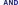

# Workflow Designer

Workflow Designer provides graphical user interface to design a workflow by dragging and dropping.


## Editing

Desginer support copy,paste, cut etc., as well as shortcut keys to ease your opertions..

### Nodes Copy and Paste

While mouse is hovering a node , press Ctrl-C (Win) / Cmd-C (Mac) to copy it, move mouse to any position on the canvas, proess Ctrl-V (Win) / Cmd-C (Mac) to paste it.

While mouse is hovering a node, press Ctrl-X (Win) /Cmd-X (Mac) to cut it, later, you may paste the cutted node at another location wil Ctrol-V (Win) /Cmd-V (Mac)

### Connext Routing Text

While mouse is hovering a connection , press Ctrl-C (Win) / Cmd-C (Mac) to copy it's routing label, move mouse to hover another connection, proess Ctrl-V (Win) / Cmd-C (Mac) to paste it.

### Keyboard shortcut

- d: Mouse over a node or a connection, press d to delete it.
- cb: Mouse over a connection, press "cb" to move it's starting point
- ce: Mouse over a connection, press "ce" to move it's ending point
- gt: Mouse over a node, press "gt" to link it to another node
- ct: Mouse over a connection, press "ct" to clear its text

### Copy / Cut / Paste

- Ctrl-C / Cmd-C to copy mouse overing node or connect
- Ctrl-X / Cmd-X to cut node or connect
- Ctrl-V / Cmd-V to paste nord or connect text

- To make a new copy of an exiting node
  - Move mouse to source node
  - press Ctrl-C on Windows or Cmd-C on Mac
  - Move mouse to blank area of the canvas
  - Press Ctrl-V on Windows or Cmd-V on Mac
- To make a node (destination node) the same as another (source node)
  - Move mouse to source node
  - press Ctrl-C on Windows or Cmd-C on Mac
  - Move mouse to the destination node
  - Press Ctrl-V on Windows or Cmd-V on Mac
- To make a connection (destionation) text the same as another (source connection)
  - Move mouse to source connection
  - press Ctrl-C on Windows or Cmd-C on Mac
  - Move mouse to the destination connection
  - Press Ctrl-V on Windows or Cmd-V on Mac

## Select

Select one: click the node to selecte it.

Select many: click the nodes while holding Win key or Command key

Select all: Ctrl-A or Command-A.

Select with mouse: hold down Shift-key, click and move mouse to select one to many nodes. Shift-Meta to add more to selected.

## Move

To move one signle node, click on it, move mouse while holding.

To move many nodes, click on them while holding Win key on Windows or Command key on Mac, while those nodes are in "selected" status, drop any of them to antoher location, other selected will move simultaneously.
To move all nodes, press Ctrl-A or Command-A to select all nodes, then click on one selected node to move them all together.

On the left is the toolbox, click each tool to use it.

## Pointer 

Pointer is used to select a node or a connection.
_Press ESC anytime to select Pointer._

Under Pointer mode, you are able to:

1. select a node or connect by clicking it.
2. open property window of node or connect by shift-clicking it
3. move a node by dragging it.
4. move a connection by clicking it while holding ALT key (Opt key on Mac OsX), release ALT key, then click on another node should be connected.
5. pan canvas by clicking on blank area of canvas then dragging it.

## Node Type

MetatoCome designer support various node types, they are Activity, Inform, Script, Timer, Sub Process, AND, OR, Ground, and Connect.

- Activity is a task need to be done by human
- Inform is used to send email to certain people.
- Script is used to embed Javascript in a running process, you may use to control the routing of the process, call a remote web-services running on another system.
- Timer is used to pause process for certain time, when you need to execute a task after certain time of a previous task's completion, or when you need to dispatch tasks repeatedly, Timer node is helpful for these.
- Sub Process is used to embed another workflow, or to start another standalone process.
- AND is a logic operation node to wait for compeletion of all previous tasks
- OR is a logic operation node to wait for completion of any previous task
- Groud is used to sink the execution route running to it without having to point to the END node.
- Connect is a link between two nodes.

## Node Properties

Nodes of most types have properties, Shift-click on a node to open it's properties window to view or edit them. Clicking on the small arrow icon besides a selected node also bring up properties window.

Connection also has it's properties, shift-click on a connection to bring it up.

## Node ID

Every node has it's unique ID which is automatically generated by default. Some time, especially when you need to program process logic with script and need to get the user's decision of a node, you may find reassigning a meaningful ID to a node much helpful.

To assign user-defined ID to a node, input new ID in properties window and click on "Set" button. You have to click on this button deliberately to make the new ID assigned.

At the end of designer menu, there is a checkbox to show/hide node IDs on the canvas.

## Node specification

### Activity 

_Press 1 anytime to select Activity_

An activity is a task need to be done by human.

#### Operations

- Click on canvas to place an Activity node
- Shift-Click on an Activity to open it's properties
- Drag it to move to another location

#### Title

Activity (Task) title can include process level variables value by placing variable name in square brackets, like [var_name], [var_name] will be replace with the value of var_name.

For example: If you have a variable name 'Interviewee_name", and the interviewee is "John", then the work title with a name of "Please approve offer letter of [Interviewee_name]" will be "Please approve offer letter of John", Simple.

#### Participant

Define task participants with Role Definition String,

See [PDS page](/designer/pds) for details

#### Vote

If there are more than one participants, you may choose how to decide the final decision among many decisions by selcting VOTE modal.


Vote models includes:

The last one

> the decision of the last vote.

The most

> The decision that is made of the most people.

The least

> The decision that is made of the least people.

All the same or fail to

> The same decision ( one and the only one) of all people,
> if there are more than one decisions, the final decision will be what option specified as "failto".

More than %, or fail to

> The decison which has percentage bigger than or equal to certain number.
> If there is no decision earn that percentage value, the final decision will be what option specified as "failto".

If any match

> If any one's decision match the specified option, take it as final decision and finish vote.
> If no one choose that option, use the decision of the last person as final decision.

If any, or else the most

> If any one's decision match the specified option, take it as final decision and finish vote.
> If no one choose that option, use the decision the most people chosed.

If any, or else the least

> If any one's decision match the specified option, take it as final decision and finish vote.
> If no one choose that option, use the decision the least people chosed.

If any, then all the same , then the most

> If any one's decision match the specified option, take it as final decision and finish vote.
> If no one choose that option, use the decision all people chosed (the one and the only one).
> If more than one decisions are made by all participant, use the most chosed.

If any, or fail to

> If any one's decision match the specified option, take it as final decision and finish vote.
> else, use the "faileto" option.

#### Transferable

Check transferable to make this work to allow task owner to transfer the task to another user.

#### Keep single task in loop

When you design a workflow running some loop, for example, we have 7 actions named A,B,C,D,E,F,G respectively, and the routing relationship among them are: A->B->(C,D->E->B), means: A goto B, B goto C and D, D goto E, E goto B.
So, the workflow process may run like A->B->C and D, then, while C is running, user pick up D task, the process runs continually to D->E->B->C, you see, there are another C when the previous C is still running.
If you check the checkbox of Keep single task in loop, the running previous C will be kept, no new C will be disptachted.
IF you uncheck the checkbox, while the running previous C is kept, another new C task will be dispatched.

#### Instruction

Give some instructions to people who take part in this task

You may include HTML tags/Handlebars tempalate or varName in brackets in instruction test.

#####Supported HTML Tags

Only following HTML tags are supported:

"b", "i", "em", "strong", "a", "blockquote", "li", "ol", "ul", "br", "code", "span", "sub", "sup", "table", "thead", "th", "tbody", "tr", "td", "div", "p", "h1", "h2", "h3", "h4"

##### Handlebars

Handlebars format is used to include process variables. If a previous node has a variable named "days", then, {{days.value}} can be included in instruction to embed it's value in instruction.

##### Var in square brackets

[var_name] will be replaced with var value.

You may also have {{days.title}} {{days.type}} etc. included if required.

#### Variables

define variable name, type etc.

##### **Name**:

Variable name should be a valid javascript varialbe name,
that means, a variable name should start with an alphabetic, or underscore, followed by one to many alphabetic or underscore or numbers.
invalid name will make your workflow fails to run.

##### **Type**:

Variable name with specific prefix also indicates variable types, determing how Metatocome SaaS show it to end-users.

###### Prefix

- "email\_" : an email type input.
- "password\_" : an password type input.
- "url\_" : an url type input.
- "range\_" : an range type input.
- "number\_" : an number type input.
- "dt\_" : an datetime type input.
- "datetime\_" : an datetime type input.
- "date\_" : an date type input.
- "time\_" : an time type input.
- "color\_" : an color type input.
- "search\_" : an search type input.
- "select\_" : a select type input.
- "sl\_" : a select type input.
- "sel\_" : a select type input.
- "file\_" : an file type input.
- "radio\_" : a radio type input.
- "textarea\_" : a textarea type input.
- "ta\_" : a textarea type input.
- "checkbox\_": a checkbox type input.
- "cb\_": a checkbox type input.
- "ou\_": an Organization Unit Selector
- "usr\_": an user ID type input
- "user\_": an user ID type input
- "tbl\_": an table type input.
- any other name : a normal input.

###### OU selector

A variable starts with "ou\_" will provide user a selection box of the current orgchart. The orgchart is configurable by people who have the correspoinding access right, normally, the MTC admin of your organizaiton.

An OU selector variable named as "ou_varname", it can have opitons like "top_ou_id;[yes|no]", the string before ';' is the ouid of the first organizaitonal unit, the string after ';' is used to indicate whether the selection list should include the top item or not.

###### User selector

A variable starts with "usr\_" or "user\_" provides user with a input box for input and validate user id, MTC keep validating while you are inputting, and give you feedback of the result.

###### File uploader

A variable starts with "file\_" will show the user a file drop area, use can drag a file and drop it onto the drop area to upload a local file to MTC. Later, other users could view it, or download it.

###### Internal Variables

Following variables you may use directly without being explicitly defined.

- starter: the uid of the process starter,
- starterCN: the Name of the process starter.
- ou_SOU: the OU code of the process starter,

- ou_user_XYZ, the OU code of a user_XYZ variable

These internal varaibles are aslo available for:

- Workflow Context variables display,
- Handlebars in comments input, for example: "{{starterCN.value}}"
- Activity title, for example: "Activity started by [starterCN]"

###### **Selection Option**

For a variable named like "select\_", "sel\_", "sl\_", or "ou\_",

- options should be delimited by semicolon (;), for example "option1;option2;option3";
- For "ou\_" variable, the first option will be used as the top OU id, the second is "yes" or "not", whether to include the top itself.
- options can also get from a pre-defined list.
  - A list is defined in a list group.
  - A list has it's own key in a list group.
  - "R:list_group_name" to get default items from a list group.
  - "R:list_group_name:key" to get items from a list group by key.
- list can be cascaded To make cascaded list. you may:
  - use T:cascade_list_name, for example, you may have province list "select_A" defined as "R:province_list;T:select_B", then, you may define select_B as "R:city_list", then, once use pick a province from select_A, select_B will get the selected value from select_A, and use it as list key to refresh options for select_B, say, get all cities of the selected city.

###### **Table**

A table allow users to input values with a table row by row, column by column.
Table variable name starts with tbl\_

Table columns are defined with a string delimited by |,

- individual column can have prefix to define its type:
  - "date\_" (for date input),
  - "dt\_" (for date time input).
  - "sel\_" (for selection)
    - Options for this selection are given as (OPT1:OPT2:OPT3)
- column's title can be defined with [title=TITLE], or the variable name without prefix. for example, variable dt_THIS with have a title THIS automatically.
- default value can be defined with [default=DEFAULT_VALUE],
- if average value of the column is required, mark it with [avg]
- if sum value of the column is required, mark it with [sum]
- get how many days between two date type column, define it with =datediff function.
- get how many days lasting between two datetime, define it with =lastingdays function.

####### Example:

```
date\_开始时间[title=开始日期]|date\_结束时间|从哪里[default=机场]|到哪里[default=公司]|sel\_出行方式(飞机:高铁:长途汽车:出租车)[default=高铁]|=datediff(date\_开始时间,date\_结束时间)+1[title=出差天数(天)][default=0][avg]|dt\_开始时点|dt\_结束时点|=lastingdays(dt\_开始时点,dt\_结束时点,0.5)[title=请假天数][default=0][sum]|number\_报销金额[sum][avg]
```

The table above has following columns:

- 开始时间：
  - 类型：日期
  - Title: 开始日期
- 结束时间
  - 类型：日期
  - Title: 结束时间
- 从哪里
  - 缺省值：机场
- 到哪里
  - 缺省值：公司
- 出行方式
  - 类型：选择列表
  - 可选项：飞机，高铁，长途汽车，出租车
  - 缺省值：高铁
- 出差天数（天）
  - 类型：公式
  - 值：开始日期，与结束日期的天数差别+1，如为同一天，则值为 1.
  - 缺省值：0
  - 计算平均值
- 开始时点
  - 类型：datetime
- 结束时点
  - 类型：datetime
- 请假天数
  - 类型：公式
  - 值：开始时点，与结束时点的差别，规整到 0.5 天
  - 缺省值：0
  - 计算总和
- 报销金额
  - 类型：数字
  - 求总
  - 求平均

##### **Value**

the default value of this input.

- for normal input, the default value will be set in the input box.
- for select/checkbox/radio, the default value will be selected.

##### **Formula**

You may use formula for a variable which we have a value the same as the the result of its formula.

Formula is defined in the variable's value field, starts with an "=".

Formula is Javascript expression. try simple expression is strongly recommanded.

Examples:

```
=first_name + " " + last_name
```

If first_name varialbe has a value of "John", last_name is "Smith", then the result should be "John Smith".

```
=first_name.substring(1)
```

If first_name is "John", the result will be "ohn";

##### **Label**

The label of this vairable.

##### **Placeholder**

the placeholder for input or textarea

##### **Break Row**

add a new line after this variable

##### **ID**

give it an optional ID

##### **Required**

this variable's value must be provided.

##### **Visible**

use PDS to define whom this var should be visiable to

**Note:**
Sometime, some sensitive data might should be kept secret from some participants even they have been involved in the process. For instance, in a interview process, the offered salary may not be able to seen by interviewer, only HR and manager could see it, thus, we may use PDS to make this happend.

##### **When**

use "when expression" to control when a variable is availabe for inputting.
When expression is a logical expression to compare values of a RV(reference variable) and a GV(given value), it's grammer is:

```
RV[=|==|===|>|>=|<|<=|!=]GV
```

let's say we have:

- A checkbox named "checkbox_req". We want inputbox of "reason" to appear only when "checkbox_req" is checked. then we could define "when expression" for "reason" as:
  ```
  checkbox_req=true
  ```
- A kvar named "number_amount", and we want another kvar named "upper_price" to appear only when "number_amount" has a value bigger than 100, then we could define "when expression" for "upper_price" as:
  ```
  number_amount>100
  ```

GV is automatically converted to the type of RV, at this momnent, only string, number, boolean is supported. it's unnecessary to quote with '"' if it's a string unless it's an empty value.

for example, to compare a value is equal to string "string", we simple define

```
kvar=string
```

if we need to check whether another kvar has value instead of being blank (user does not key in anything in it's input box), we should use

```
kvar!=''
```

### Inform 

- Press 2 at anytime to use Inform
  An Inform node is used to send message to people.

#### Operations

- Click on canvas to place an Inform node
- Shift-Click on an Inform to open it's properties
- Drag it to move to another location

#### Recipiants:

- Who will receive emails, define use [PDS](/designer/pds)

#### Subject and Content:

- may use simple html or Handlebars to embed process variables

### Script 

- Press 3 at anytime to use Script

#### Operations

- Click on canvas to place an Script node
- Shift-Click on an Script to open it's properties
- Drag it to move to another location

#### Sync Mode

Run script in sync mode

#### Async Mode

Run script in async mode, external program callback to MetatoCome later to make it continue.

##### Callback Point

in async mode, you need to let the CBPid (Callback Point ID) for later calling back. you may post this CBPid to your server like this:

```
MtcSendCallbackPointId=function(url, extraPayload);
```

For example:

```
MtcSendCallbackPointId("http://demo.mycompany.com/remembercbpid", {"foo":"bar"});
```

that will call your own API endpoint at "http://demo.mycompany.com/remembercbpid",
This API endpoint will receive payload:

```
{
  "cbpid": "A RANDOM Callback Point ID",
  "foo": "bar"
}
```

Your program need to record the value of "cbpid" somewhere.

The workflow process will standby from now on until someday/sometime you callback MetaoTocome.

##### Callback to MTC

MetatoCome's callback poit is:

```
http://MTC_HOST/workflow/docallback
```

You should callback with payload:

```
{
  cbpid: "the cbpid",
  decision: "Your decision on this point",
  kvars: {"foo","bar"}
}
```

"cbpid" is what you saved in last step, "decision" will be used to determine where to go afterwards, while "kvars" is a JSON which content will be embeded into process context. Following steps could read data defined in "kvars".

**Note**, your code must login to MTC first, get session key, and invoke callback point with your sessionkey.

**Note**, use MTC SDK is much easier with

```
 SDK.callback(
  {
    cbpid: "the cbpid",
    decision: "Your decision on this point",
    kvars: {"foo","bar"}
  }
 );
```

#### Code

Embed any javascript code in this node.

##### Return value

```

ret = RET_VALUE;

```

Return value is used as routing option to decide where to go after this script node.

Notice: you may return multiple string as "node decisions" within an array. If the current script node points to three following nodes, the option of each route to them are labled as "Choice A", "Choice B" and "Choice C". If you write code like:

```
ret = ["Choice A", "Choice C"];
```

then the respected two nodes out of three will be dispatched after the execution of this script node.

##### Insert any variable

```

MtcSet(var_name, var_value, var_label)

```

After that, thsi variable named 'var_name' is available for following process.

\*\* If a varialbe named "var_name" exists, it's value will be overwrite with this one.

##### Get value of variable.

```

MtcGet(var_name)

```

##### Get value of table.

```

// get table object first
let table = MtcGet("table_name")
// get table rows,
let rows = table.rows
// rows is an Javascript Array object, which will contain all rows value of the table
// we may then interate rows with normal Javascript operations on an array
// columns are also addressable:
let v = rows[0][0];  // the 1st column of the 1st row
v = rows[0][1];  // the 2nd column of the 1st row
v = rows[1][1];  // the 2nd column of the 2nd row

```

##### Get node decision

```
MtcGetDecision("THE_NODE_ID");

```

or

```
MtcDecision("THE_NODE_ID");
```

##### Set node decision

```
MtcSetDecision("THE_NODE_ID", DECISION);
```

or

```
MtcDecision("THE_NODE_ID", DECISION);
```

#####Set inner Team
Dynamically set a team for use later.

```

setRoles({
SGT: "ab@email.com",
DIRECTOR: "cd@email.com",
});

```

For steps after this script, any task assigned to role 'SGT' will go to a person whose email is "ab@email.com", any task assigned to role "DIRECTOR" will go to a person whose email is "cd@email.com"

#### Script logging

You may use normal javascript "console.log" to log debug messages in your script code. to view the log, click on 'Show log' on a process details page.

### Timer 

A TIMER node is used to control process running time, the process only run through this node when

- From Start: how long after the start of the whole process
- From Now: how long after the invoking of this Timer node(end of previous node).
- Fix: Specific date and time

### Sub Process 

An sub-processs will be invoked to run, and the parent process will continue only when the sub-process has been completed.

sub-process's last return value will be taken as the return value from sub-process, parent process will use it to determine where to go after it.

An sub-process can also run in standalone mode, therefore, the parent process will not wait for it's completing.

**Note:** sub-process running in standalong mode always return "DEFAULT" immediately to it's parent, thus, there must be at least one following connection with 'DEFAULT' option to have parent process running as expected, or else, the parent process will stop at invoking this sub-process.

Here is an exmaple,

take a look at the following process monitoring capture, you could notice the process did not continue after "Sub". the reason is that "Sub" had been set to "standalone" mode and would return "Default" always and immediately but there is no "Default" route after it.

### AND 

An AND node will make process wait for completion of all it's precedent nodes.

### OR 

Any precedent node is completed, an OR node will be went through, process will navigate to the following nodes of OR.

An AND node will make process wait for completion of all it's precedent nodes.

### Ground 

A Ground node could have no folloing nodes, means the routing is grounded or sink.

### Connect 

Connect two nodes to define a route between them.
Click one node, then click another node, a curved line will be drawn between them.
Shift-clicking on a connection will bring up the connection property window, simply give the connection a Case Value (a string), the Case Value will be displayed alongside of the connection line.
this case value will be used to determine whether or not this route will be taken or not after it's FROM node has been completed.

A connection between two nodes has direction, it always point from one node (A) to another (B), means that the workflow should run from task A to task B.

A connection can have option, option define the route. for example, there is one connection between A to B, there is another connection between A to C, if we give A to B an option value 1, and give A to C an option value 2, then, if A return 2, the workflow will run to C, B will not be routed to. if A is an activity, the user who do that activity will be presented with option 1 and 2 to decide. if A is a script, you may use "ret=2" to return 2 from node A.

#### Build a connection

- Select CONNECT tool , or simple press 9, the CONNECT tool will be highlighted
- Click on the first node A,
- Click on the second node B

To connect multiple nodes in chain, click on them while holding Alt key.

#### Move a connection

- Hold Alt key (MAC: Opt), click on the first half of a connection then pick another node to re-select its' staring node
- Hold Alt key (MAC: Opt), click on the second half of a connection then pick another node to re-select it's ending node

or:

- Mouse over a connection, press "cb" to move it's starting point;
- Mouse over a connection, press "ce" to move it's ending point;

#### Cancel connecting

If you would like to cancel while connecting, double click on blank area of canvas, or press ESC

#### Delete a connection

- Mouse over a connection, then press Backspace or Delete

#### Give connection a value

- Hold Shift key, click on a connection, input is option value in the pop-up.
- While pointing at a connection, press 'ct' to clear it's value
- While pointing at a connection, press Ctrl-V to paste a value, after press Ctrl-C on an existing connection.

The connection values will be prompted as Buttons to users who are doing the work the connection linked from.
User click the button to make his/her decision, the workflow engine use user's decision to determine what's the next step.

These buttons are displayed sorted by their labels' alphabetic order, Thus, "A Choice" is always displayed before "B Choice", and "1. A Choice" is always displayed before "2. A Choice".

#### Set processs contextual variable on connection

You may let variables be set when process run through a connecton.
let's say, we have a connnection between A and B, and we have variables defined on it. when user complete A, the Engine will embed those variables to process context before dispatch task B.


