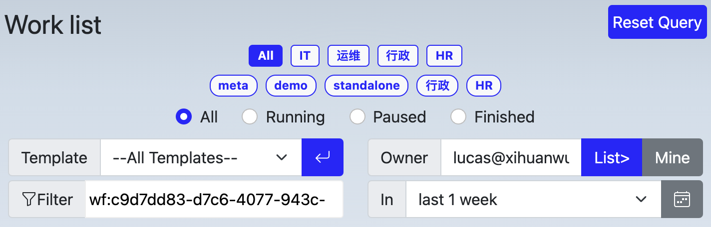

# Work list

Work list show work items belong to current user, or belong to users who delegate their works to current user, or those tasks disptached from a rehearsal process.

## Reset Query

Template explorer provides detailed criteria for searching, Reset Query is used to reset query critera by one-click

## Tags Area

Tags are used to categorize templates, organizaiton level tags are defined by administrators and available for everyone in your organizaiton, while personal tags are available individually.

- organizaitonal tags are displayed in a round corner rectangle, like 
- personal tags are displayed in a pill, like 

Click a tag, explorer will search those work items belong to templates with the tag and display them in the result table at the lower part of explorer.

A template can have more than one tags, hold shift key while clicking a tag will make tag multi-selection. thus, MetatoCome will search for those templates which has all the highlighted tags.

### Status Area

Filter work items with status

### Extra Filter Area

Filter results with template name, owner, title, and timespan.
if the title fitler has a value of "wf:WORKFLOW_PROCESS_ID", only work items belong to specified process will show.

### Result Table

List out any workitems meet above requirements: tag, name filter, owner etc.

Click on work item title to view the [work page](./workpage.md).

## For Developer

Developer might integrate work list in to your own application with MetatoCome APIs, and provide your own User Interface to your user.
