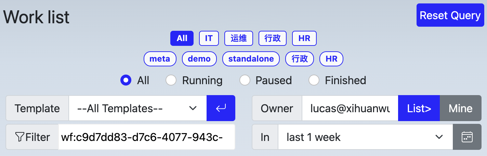

# 工作列表

Work list show work items belong to current user, or belong to users who delegate their works to current user, or those tasks disptached from a rehearsal process.
工作列表列出以下工作项：

1. 归属与当前登录用户的工作项；
2. 其他人[委托](../admin/delegation.md)给当前登录用户的工作项；
3. 彩排时的所有工作项；

## 重置查询

工作列表搜索条件，通过重置查询，一键返回缺省查询条件。

## 标签区

标签用于对工作流模板进行归类，通过点选标签，可以过滤出那些符合该标签的流程的工作项。

按住 Shift 的同时点标签，可以多选标签，从而过滤同时归属与多个标签的流程的工作项。

## 进入工作项页面

点工作项名称，即可进入[工作项页面](workpage.md)

## 推迟工作项

如果需要延迟工作项的显示，可以在选择天数后，点击“延后”按钮
在延后期间，工作项持续时长依然被记录，只是在延后期间，工作项不再出现在工作列表中

## 显示延后工作

在工作项列表底部，点显示延后工作按钮，将显示所有已延后的工作，在列表中可撤回延后
