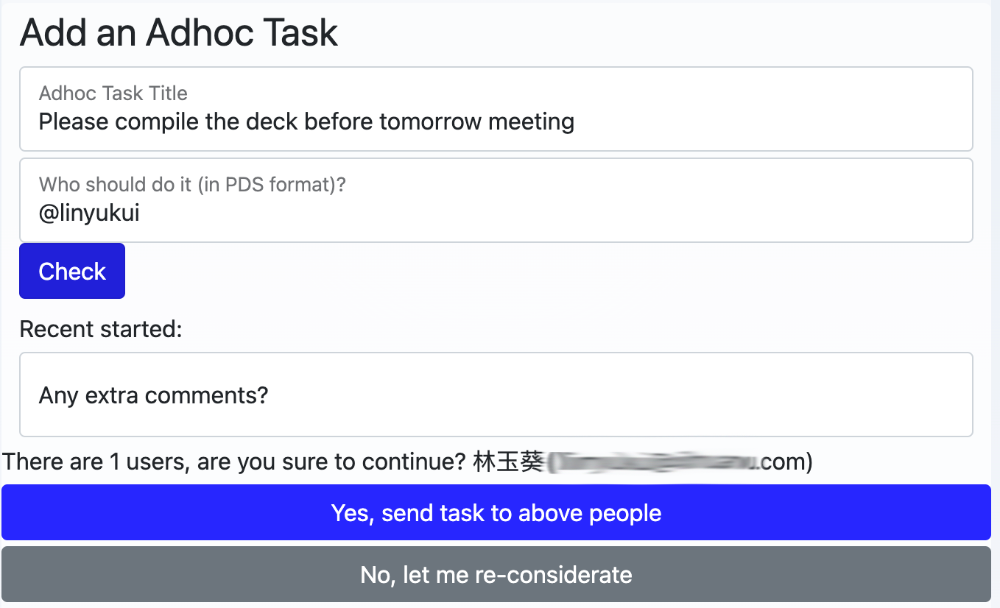

# 工作项操作

用户在工作项页面上完成工作, 提供反馈, 以及参与工作讨论。

用户可能的操作包括：

- 输入要求的数据；
- 为后续工作留下备注文字；
- 做出决策 (例如，对一个申请项审批通过或拒绝)；
- 打回到上一步；
- 撤回之前完成的一项工作；
- 发起一个独立任务
- 将当前工作，转给他人
- 查看彩排数据信息
- 查看工作项所属的流程信息
- 查看同一流程内的工作记录

## 数据输入

数据项标题带星号（\*）的，为必须输入项

## 评论

留下评论，支持使用 HTML，可以嵌入流程参数，如 {{var_name.label}} {{var_name.value}} {{var_name.type}} {{var_name.name}}.

使用 @somebody 来提醒用户

## 工作项决策

在工作流程设计时，从当前工作项节点指向后续工作项节点的连接线上，如果设置了路径值，则这些路径值，将以按钮的形式显示在工作界面上，供用户选择，用户选一个按钮后，流程将根据用户的选择，流向后续工作流节点。

例如，我们的工作流模板中有 A、B、C 三个节点，A 到 B 之间的连接线的路径值为“同意”，A 到 C 之间的连接线的路径值为“拒绝”，那么，在 A 这项工作的工作界面上，用户可以看到“同意”和“拒绝”两个按钮，用户点“同意”后，流程会从 A 流向到 B。

## 打回

把一项工作打回到上一步
例如，一个用户是审批者，如果审批者在审批时，发现上一步所提交的待审信息不合格，就可以把工作打回上一步。

打回按钮只在当前审批工作状态为“进行中”时，才会出现。

## 撤回

如果你在提交了一项工作后，发现需要修改，只要后续工作没有完成，你可以撤回已经完成的工作，以便修改后重新提交。

撤回按钮只在满足下述条件时才会出现：1. 要撤回的工作已经完成，2. 后续工作还在进行中，3. 当前用户是要撤回工作的所有者。

## 下发独立任务

当前用户可能发现需要随时向其他人发送一项任务（在流程设计时没有考虑进去），在工作项页面上可以随时发送一项独立任务。

独立任务的执行人需要通过[PDS](/designer/pds.md)方式制定，为防止制定给错误的人，MTC 提供了检查工作，确定后，就可以发出。

请注意，独立任务，在工作流程结束时，不会自动放弃。也就是说，独立任务的执行，不会影响规范化的流程运行路径和状态。
这样的好处是，规范化流程可以按原设计执行，而独立任务总是能保证执行者执行该独立任务。

## 转办

用户可以把当前工作转交给别人办理。
流程设计时，需要在节点的属性窗口中，指定该工作可转办。

## 彩排信息

流程设计者，在设计流程时，可以多次彩排，检查流程是否按预期运行。彩排时，工作项的执行者无论是谁，工作总是发送给设计者，同时显示，应该下发给谁，并不会真正发送给所制定的真正用户，这样可以防止在流程设计尚不成熟时，给真正用户带去干扰。

## 流程上下文信息

显示当前工作项所属的流程的上下文信息

## 工作记录

工作记录列出，所有已经完成、和正在进行中的工作项，包括工作项标题、执行者、时间、数据等信息。

点击工作记录中的执行者名称，页面转向到该执行者的对应工作的工作页面

## 开发者

开发者，可以通过 MTC API，开发自己的应用界面。MTC 仅提供 H5 界面，而开发者可以在自己的应用中集成以上功能
